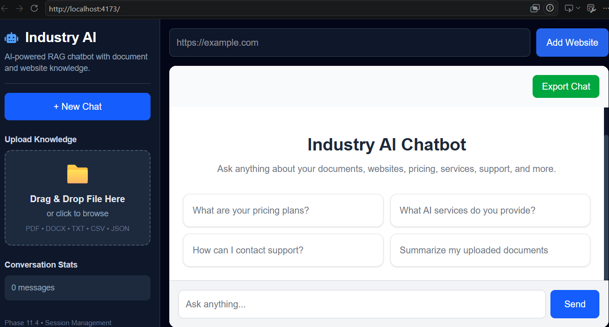
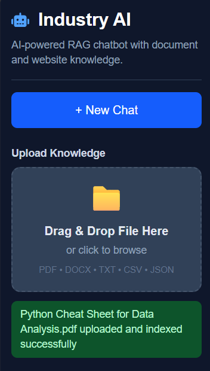
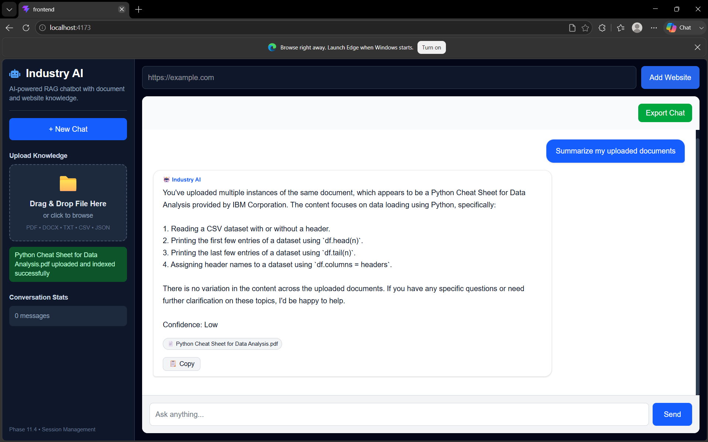
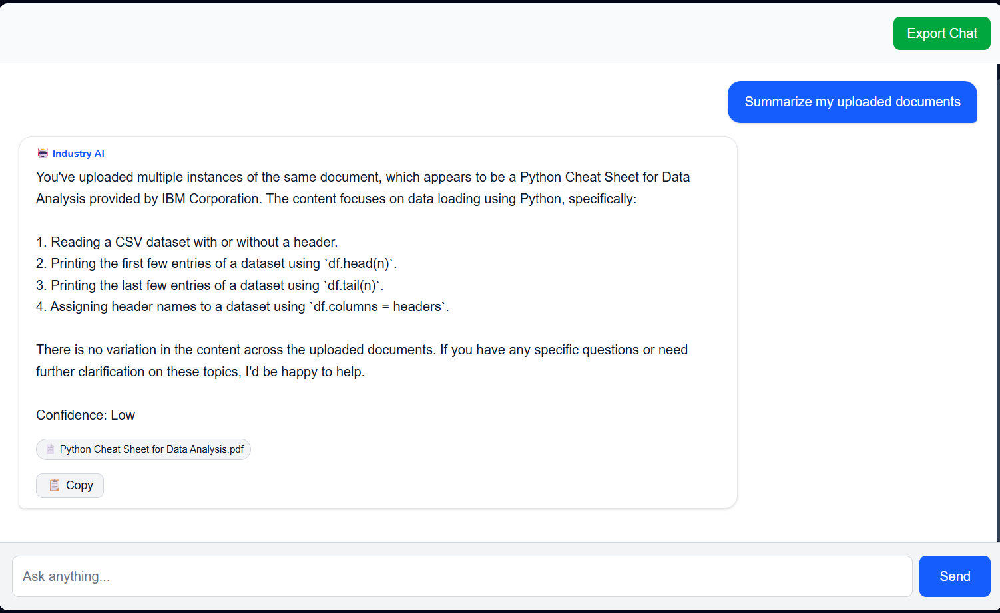

# Industry AI Chatbot

An AI-powered Retrieval-Augmented Generation (RAG) chatbot built using FastAPI, React, LangChain, FAISS, and Groq.

The chatbot enables users to upload documents, ingest website content, and ask natural language questions. Using semantic search and Large Language Models (LLMs), it retrieves relevant information from a custom knowledge base and generates context-aware responses.

---

# Live Demo

### Frontend

https://industry-chatbot.vercel.app/

### Backend

https://industry-chatbot.onrender.com

### GitHub Repository

https://github.com/Samiran006/industry-chatbot

---

# Features

## AI & RAG

* Retrieval-Augmented Generation (RAG)
* LangChain Integration
* Groq LLM Integration
* Semantic Search
* Context-Aware Question Answering
* Source Attribution
* Confidence Scoring

## Knowledge Base

* PDF Document Support
* DOCX Document Support
* TXT File Support
* CSV File Support
* JSON File Support
* Website Content Ingestion
* Dynamic Knowledge Base Updates

## Vector Search

* FAISS Vector Database
* Efficient Similarity Search
* Document Chunking
* Embedding-Based Retrieval

## Chat Experience

* Conversation Memory
* Context-Aware Responses
* Suggested Questions
* Auto Scrolling Chat Interface
* Responsive User Interface

## User Interface

* Modern React Frontend
* Drag-and-Drop File Upload
* Toast Notifications
* Clean Sidebar Navigation
* Mobile-Friendly Design

---

# Architecture

User
 │
 ▼
React Frontend (Vercel)
 │
 ▼
FastAPI Backend (Render)
 │
 ├── Document Loader
 │
 ├── Website Ingestion
 │
 ├── FAISS Vector Store
 │
 ├── LangChain Retriever
 │
 └── Groq LLM
 │
 ▼
Generated Response

---

# Screenshots

## Main Interface



## Document Upload



## Website Ingestion



## Chat Conversation



---

# Tech Stack

## Frontend

* React
* Vite
* Tailwind CSS
* Axios
* React Toastify
* React Dropzone
* React Icons

## Backend

* FastAPI
* Python
* LangChain
* FAISS
* Groq
* BeautifulSoup
* PyPDF
* Pandas

## AI Stack

* Retrieval-Augmented Generation (RAG)
* Vector Embeddings
* Semantic Search
* Context Retrieval
* Large Language Models

---

# Project Structure

industry-chatbot/

├── backend/
│   ├── api/
│   ├── memory/
│   ├── rag/
│   ├── services/
│   └── main.py
│
├── frontend/
│   ├── src/
│   ├── public/
│   └── package.json
│
├── knowledge_base/
│
├── vector_store/
│
├── docs/
│   └── screenshots/
│
├── requirements.txt
├── .env.example
├── .gitignore
└── README.md

---

# Installation

## 1. Clone Repository

```bash
git clone https://github.com/Samiran006/industry-chatbot.git
cd industry-chatbot
```

---

## 2. Backend Setup

Create a virtual environment:

```bash
python -m venv venv
```

Activate environment:

### Windows

```bash
venv\Scripts\activate
```

Install dependencies:

```bash
pip install -r requirements.txt
```

Create a `.env` file:

```env
GROQ_API_KEY=your_groq_api_key
GOOGLE_API_KEY=your_google_api_key
```

Run backend:

```bash
uvicorn backend.main:app --reload
```

Backend URL:

http://127.0.0.1:8000

Swagger Documentation:

http://127.0.0.1:8000/docs

---

## 3. Frontend Setup

Navigate to frontend:

```bash
cd frontend
```

Install dependencies:

```bash
npm install
```

Run frontend:

```bash
npm run dev
```

Frontend URL:

http://localhost:5173

---

# API Endpoints

## Chat

GET /chat

## Upload Documents

POST /upload

## Website Ingestion

POST /ingest-website

---

# How It Works

1. Upload documents or ingest website content.
2. Documents are loaded and split into chunks.
3. Embeddings are generated for each chunk.
4. Embeddings are stored in FAISS.
5. User submits a question.
6. Relevant chunks are retrieved using semantic search.
7. Retrieved context is passed to the Groq LLM.
8. The model generates a context-aware answer.
9. Sources and confidence information are returned to the user.

---

# Project Highlights

* Built an end-to-end AI chatbot using Retrieval-Augmented Generation (RAG).
* Supports multiple document formats including PDF, DOCX, TXT, CSV, and JSON.
* Implements semantic search using FAISS vector indexing.
* Integrates Groq LLM for fast and accurate responses.
* Supports website knowledge ingestion.
* Fully deployed using Vercel and Render.
* Designed with a scalable backend architecture.
* Demonstrates practical implementation of Generative AI and LLM-powered applications.
* Showcases real-world AI application development using modern tools and frameworks.

---

# Deployment

## Frontend

* Vercel
* https://industry-chatbot.vercel.app/

## Backend

* Render
* https://industry-chatbot.onrender.com

## Vector Database

* FAISS

## LLM Provider

* Groq

---

# Future Improvements

* User Authentication
* Multi-User Support
* Persistent Database Storage
* Qdrant Integration
* Pinecone Integration
* Docker Deployment
* CI/CD Pipeline
* Admin Dashboard
* Conversation Analytics
* Real-Time Streaming Responses
* Feedback System

---

# Author

## Samiran Bangal

### Aspiring AI Engineer | Machine Learning Engineer | Data Scientist

Passionate about building AI-powered applications, Retrieval-Augmented Generation (RAG) systems, Large Language Model (LLM) integrations, and scalable full-stack solutions.

### Areas of Interest

* Artificial Intelligence
* Machine Learning
* Generative AI
* Large Language Models (LLMs)
* Retrieval-Augmented Generation (RAG)
* Data Science
* Natural Language Processing
* Full Stack Development

### Connect With Me

LinkedIn

https://www.linkedin.com/in/samiran-bangal

GitHub

https://github.com/Samiran006

Project Demo

https://industry-chatbot.vercel.app/

---

# License

This project is intended for educational, internship, portfolio, and learning purposes.
